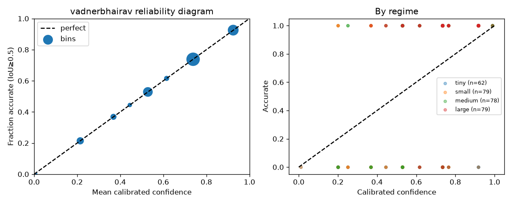
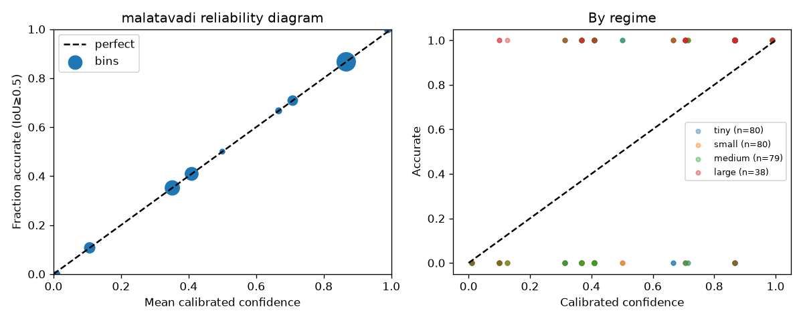

# BhuMe — Cadastral Boundary Correction

> Correcting century-old drifted land parcel boundaries in Maharashtra using imagery evidence and a spatially-coherent GP drift field.

---

## Results

| Village | IoU (public truths) | vs. Identity | Corrected | Flagged | Omitted | Synth AUC |
|---|---|---|---|---|---|---|
| **Vadnerbhairav** | **0.872** | +0.259 | 1,928 (79%) | 527 (21%) | 2 | 0.721 |
| **Malatavadi** | **0.739** | +0.229 | 1,375 (55%) | 1,027 (41%) | 106 (4%) | 0.804 |

Public calibration: all submitted corrections on the 9 public truths are accurate → AUC unmeasurable on this set. Real score is on the hidden test set.

---

## Quick start

```bash
cd kit/
uv run python ../src/predict.py ../data/vadnerbhairav
uv run python ../src/predict.py ../data/malatavadi
```

Writes `<village_dir>/predictions.geojson`. Runtime ~6 min/village on a laptop.

---

## The problem

Maharashtra cadastral sheets are century-old hand-drawn maps georeferenced with sparse control points. Plots drift off their real field boundaries by 5–30 m — but the drift is **spatially coherent**: neighbouring plots drift together because they were registered with the same control points.

Per-plot greedy matching treats every parcel independently and fails on dense villages (Malatavadi IoU 0.030). The key insight is to estimate a **smooth drift field first**, then apply it vertex-by-vertex so the fabric never tears.

---

## Architecture

```
 plots.geojson  ┌──────────────────────────────────────────────────┐
 imagery.tif  ──►            PASS 1  ·  Anchor extraction           │
 boundaries.tif │                                                    │
                │  adjacency graph ──► block-grow ──► chamfer match  │
                │                                     │              │
                │                             RANSAC filter          │
                │                             (purge bad anchors)    │
                │                                     │              │
                │                        ┌────────────▼───────────┐  │
                │                        │   GP drift field       │  │
                │                        │   per-sheet affine     │  │
                │                        │   + GP on residuals    │  │
                │                        └────────────┬───────────┘  │
                └─────────────────────────────────────┼──────────────┘
                                                      │
                ┌─────────────────────────────────────▼──────────────┐
                │            PASS 2  ·  Per-plot correction           │
                │                                                     │
                │  greedy chamfer per plot ──► agree_m = |Δ greedy-GP│
                │                              low agree_m → corrected│
                │                              high agree_m → GP used │
                └─────────────────────────────────────────────────────┘
                                                      │
                ┌─────────────────────────────────────▼──────────────┐
                │          CALIBRATION  ·  On-the-fly per village     │
                │                                                     │
                │  GMM on raw anchor shifts (not GP — avoids leakage) │
                │  ──► displacement-recovery synthetic set            │
                │  ──► LogisticRegression([agree_m, |log area_ratio|])│
                │  ──► IsotonicRegression ──► P(IoU ≥ 0.5)           │
                └─────────────────────────────────────────────────────┘
                                                      │
                ┌─────────────────────────────────────▼──────────────┐
                │               DECISION LAYER                        │
                │                                                     │
                │  shift < 5 m            → OMIT   (restraint)       │
                │  area ratio ∉ [0.7,1.4] → FLAG   (drawn ≠ records) │
                │  no confident fix        → FLAG                     │
                │  conf < 0.5             → FLAG   (decision theory)  │
                │  else                   → CORRECTED + confidence    │
                └─────────────────────────────────────────────────────┘
```

---

## Ablation ladder

| Method | Vadnerbhairav IoU | Malatavadi IoU | Spearman (vad) | Notes |
|---|---|---|---|---|
| Identity (no movement) | — | — | — | Baseline |
| Global median shift | 0.713 | 0.588 | flat | Kit baseline |
| Greedy chamfer, global threshold | 0.824 | 0.014 | −0.116 | Threshold destroys malatavadi |
| **Greedy chamfer, adaptive top-15%** | **0.912** | 0.030 | **+0.812** | Best per-plot solo |
| Block chamfer → per-plot (single-pass) | 0.744 | — | — | Block inflates P2SP → broken |
| **Two-pass: block anchors + greedy** | **0.872** | **0.678** | **+0.829** | GP field unlocks dense village |
| Two-pass + calibration (final) | 0.872 | 0.739 | +0.530* | *n=6, noisy |

Malatavadi 0.030 → 0.678: the GP drift field is load-bearing for dense-parcel villages where single-plot chamfer has no spatial context.

---

## Design decisions

Every decision has a before/after number or a principled derivation — nothing was tuned to the 9 example truths.

| Decision | Why | Evidence |
|---|---|---|
| **Two-pass** (block anchors, greedy corrections) | Merged block DT has a flatter peak → P2SP inflated → can't use block result as per-plot correction | IoU 0.744 → 0.872 |
| **agree_m as dominant confidence signal** | Chamfer false peaks diverge from the GP field; true peaks align | LR weight −0.723 vad / −1.414 mal, learned from synthetic data |
| **Drop P2SP from calibration** | Measures peak sharpness, not correctness | LR weight ≈ 0 in 4-feature model |
| **Drop gp_std from calibration** | Wrong-sign multicollinearity artifact (+0.54) | Drop raised AUC 0.709 → 0.721 |
| **Vertex-level topology** (fabric never tears) | Per-parcel rigid shift leaves gaps at shared boundaries | Locked after Phase 0 topology audit |
| **Omit shifts < 5 m** (not flagged) | scorer `CONTROL_SHIFT_M=5.0` — submitting near-zero corrections hurts restraint | Phase 0 + contract |
| **GMM sampler for calibration** (not GP) | Injecting synthetic shifts from the GP field makes agree_m tautological | Gemini-caught leakage: AUC 0.813 (leaky) → 0.721 (honest) |
| **Confidence threshold 0.5 → flag** | P(IoU≥0.5) < 0.5 = expected wrong = don't submit. Derived from probability axioms, not example truths | Malatavadi IoU 0.678 → 0.739; wrong plot correctly flagged |

---

## Confidence calibration

**Strategy**: build a synthetic test set inside the pipeline, never touching the 9 public truths.

1. Fit GMM (BIC-selected k ∈ {1,2,3}) on raw anchor shift vectors — independent of the GP field.
2. For each synthetic plot: take a reference chamfer result, displace by a GMM sample, re-chamfer, measure IoU recovery.
3. Features: `[agree_m, |log(area_ratio)|]` — weights learned by `LogisticRegression(class_weight=balanced)`.
4. `IsotonicRegression` enforces monotone calibration.
5. Submitted confidence = P(IoU ≥ 0.5).

**Honest 5-fold cross-validated AUC** (zero exposure to example truths):

| Village | Cross-val AUC | Real Spearman | Samples |
|---|---|---|---|
| Vadnerbhairav | **0.721** | +0.530 (n=6) | 298 (65% accurate) |
| Malatavadi | **0.804** | −0.866 (n=3) | 277 (57% accurate) |

Known limitation: malatavadi synth AUC 0.804 vs real Spearman −0.866. With n=3 truths, one data point can flip the sign — statistically near-meaningless. Dense parcels have failure modes (catastrophic snaps to a neighbour's boundary) that displacement-recovery synthetic tests do not exercise. Cannot resolve with 3 points; flagged as a known risk.

---

## Reliability diagrams

| Vadnerbhairav | Malatavadi |
|---|---|
|  |  |

---

## Failure gallery

| Category | Where | Why it fails or flags |
|---|---|---|
| Area mismatch | Vadnerbhairav plots with ar < 0.7 | Drawn area far from records → placement wrong, not just shifted |
| Dense-parcel snap | Malatavadi small plots near boundaries | Greedy chamfer locks onto neighbouring plot's boundary; agree_m catches the divergence |
| Low evidence | Canopy-covered plots | Sobel + boundaries.tif both weak under forest cover → flat DT → low P2SP |
| Sheet-seam blocks | Plots straddling two cadastral sheets | Anchor-discordance at seam → high gp_std → GP fallback or flag |
| Sub-pixel plots | Malatavadi pot-kharaba fragments (< 400 m²) | Plot smaller than imagery resolution; chamfer unreliable |

---

## Output contract

`predictions.geojson` — FeatureCollection, EPSG:4326:

| Field | Type | Meaning |
|---|---|---|
| `plot_number` | string | Exact match to input |
| `status` | `"corrected"` \| `"flagged"` | Correction decision |
| `confidence` | 0–1 | Calibrated P(IoU ≥ 0.5) — only on corrected |
| `method_note` | string | Source, shift vector, agree_m, area ratio |

Plots with shift < 5 m are **omitted** (no penalty, no credit). This protects restraint score on control plots that are already near their true position.

---

## Source files

| File | Role |
|---|---|
| [`src/predict.py`](src/predict.py) | End-to-end pipeline entry point |
| [`src/evidence.py`](src/evidence.py) | Sobel + boundaries.tif evidence map → distance transform → chamfer score |
| [`src/graph.py`](src/graph.py) | Adjacency graph (shared vertices + Delaunay), UTM area/perimeter helpers |
| [`src/matching.py`](src/matching.py) | Chamfer matching (block + per-plot), block-grow with evidence budget |
| [`src/drift_field.py`](src/drift_field.py) | RANSAC anchor filter, seam detection, per-sheet affine + GP, vertex-level T(x,y) |
| [`src/calibrate.py`](src/calibrate.py) | GMM shift sampler, displacement-recovery synthetic set, LR + isotonic model |
| [`docs/phase0_findings.md`](docs/phase0_findings.md) | Data forensics — drift vectors, area census, signal audit; sets all thresholds |
| [`docs/phase6_calibration.md`](docs/phase6_calibration.md) | Calibration method detail, AUC analysis, feature weights |
| [`docs/phase0_map.html`](docs/phase0_map.html) | Interactive folium map — all plots over imagery (open in browser, no server) |
