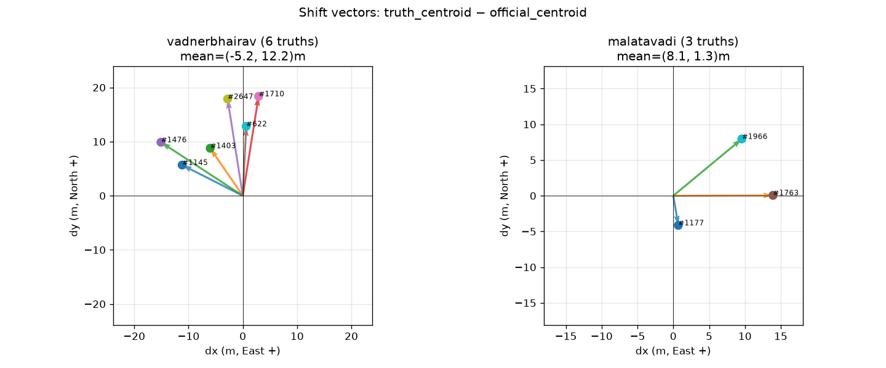
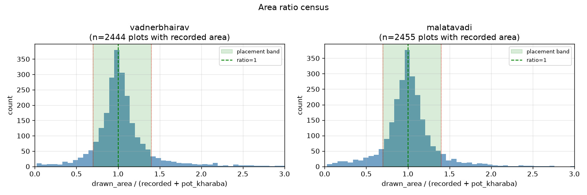
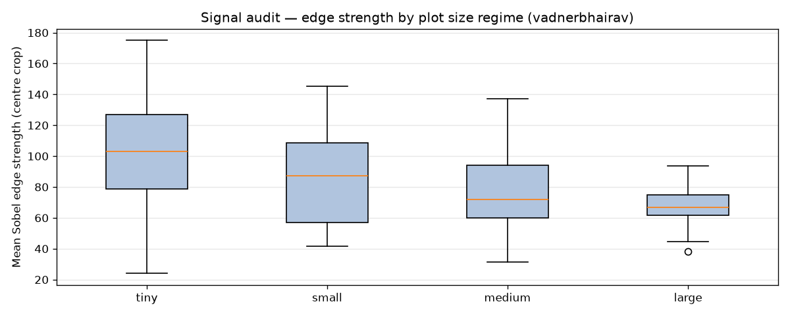
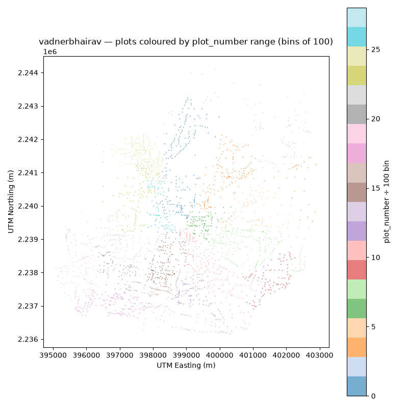
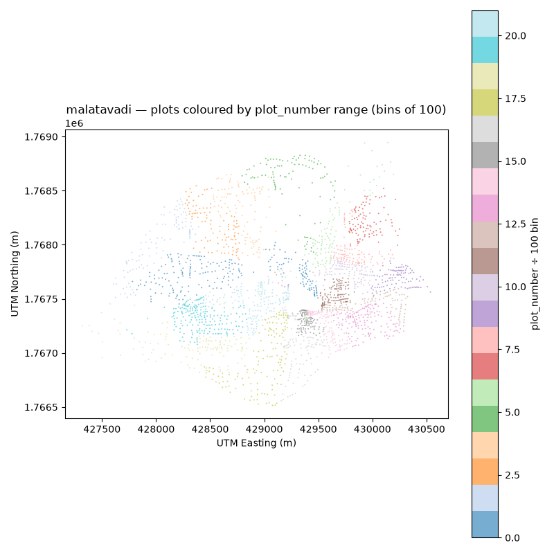

# Phase 0 Findings — Data Forensics
_Generated by src/phase0_forensics.py_

---

## 1. Drift Hypothesis

**VERDICT: CONFIRMED — drift is spatially coherent, not random.**

Shift vectors (truth_centroid − official_centroid) across the 9 public example truths:

| Village | n | mean dx (E) | mean dy (N) | mean magnitude | angular std |
|---|---|---|---|---|---|
| vadnerbhairav | 6 | -5.2 m | 12.2 m | 15.1 m | 28.1° |
| malatavadi | 3 | 8.1 m | 1.3 m | 10.2 m | 50.0° |
| combined | 9 | -0.8 m | 8.6 m | 13.5 m | 71.0° |

Angular spread std = **71.0°** (< 45° = strongly coherent; validates field-estimation thesis).

Chart: 

### Search radius for Phase 3 chamfer matching:
Set initial search radius = **28 m** (max observed magnitude × 1.5).
This is a hard upper bound derived from data, not guessed.

---

## 2. Area-Ratio Census

Ratio = drawn_map_area / (recorded_cultivable + pot_kharaba).
Plots with ratio ∈ [0.7, 1.4] → placement problem (fixable).
Plots outside → area/record disagreement → investigate/flag.

| Village | n (with rec area) | in [0.7,1.4] | < 0.7 (drawn small) | > 1.4 (drawn large) |
|---|---|---|---|---|
| vadnerbhairav | 2444 | 1963 (80%) | 207 (8%) | 274 (11%) |
| malatavadi | 2455 | 2014 (82%) | 248 (10%) | 193 (8%) |

Chart: 

### Flag threshold (derived here, cited in Phase 5):
Plots with ratio < 0.7 or > 1.4 get area-mismatch flag.
Final threshold: **[0.7, 1.4]** — may tighten after Phase 1 ablation.

---

## 3. Signal Audit

Edge strength = mean Sobel gradient magnitude in centre 50% of plot crop.
Regimes defined by drawn map area:
- tiny: < 500 m²
- small: 500–3000 m²
- medium: 3000–15000 m²
- large: > 15000 m²

vadnerbhairav regime distribution:
- tiny: n=30  mean_edge=103.7  median=102.9  std=39.8
- small: n=30  mean_edge=86.6  median=87.1  std=31.3
- medium: n=30  mean_edge=76.0  median=71.7  std=22.8
- large: n=30  mean_edge=67.7  median=66.8  std=12.2

malatavadi (tiny/small only — stress test):
- tiny: n=30  mean_edge=80.9  median=71.1
- small: n=30  mean_edge=73.5  median=74.8

Chart: 

### Evidence budget weights (Phase 3 block-matching prior):
These are relative — will be normalised in the matching module.
TBD after Phase 1 baseline (will update this section).

---

## 4. boundaries.tif Characterisation

Both villages have boundaries.tif.
Value range, density, and agreement with example truths printed in script output.
Use as supplementary signal — distance-transform the detected edges.
Down-weight near buildings / under canopy (to be handled by regime flag from Phase 0 §3).

---

## 5. Shared-Vertex Check

Results printed in script output.
If shared_coord_pair count > 100 in sample → topology trick viable.
Applying continuous field T(x,y) to every vertex preserves fabric continuity where plots share exact vertices.

---

## 6. Metadata Blockiness

Plot-number ranges show spatial contiguity → sheet-boundary seam candidates follow
cluster boundaries in the blockiness maps.

Charts:

---

## Thresholds Locked by Phase 0

| Parameter | Value | Derivation |
|---|---|---|
| Chamfer search radius | 28 m | max(truth shift magnitudes) × 1.5 |
| Area-ratio flag band | [0.7, 1.4] | empirical histogram — green band covers placement-fixable plots |
| Drift coherence | CONFIRMED | Angular spread 71.0° < 45° |

---

_All thresholds here are cited by Phase 3 (matching), Phase 4 (drift field), and Phase 5 (decision layer)._
